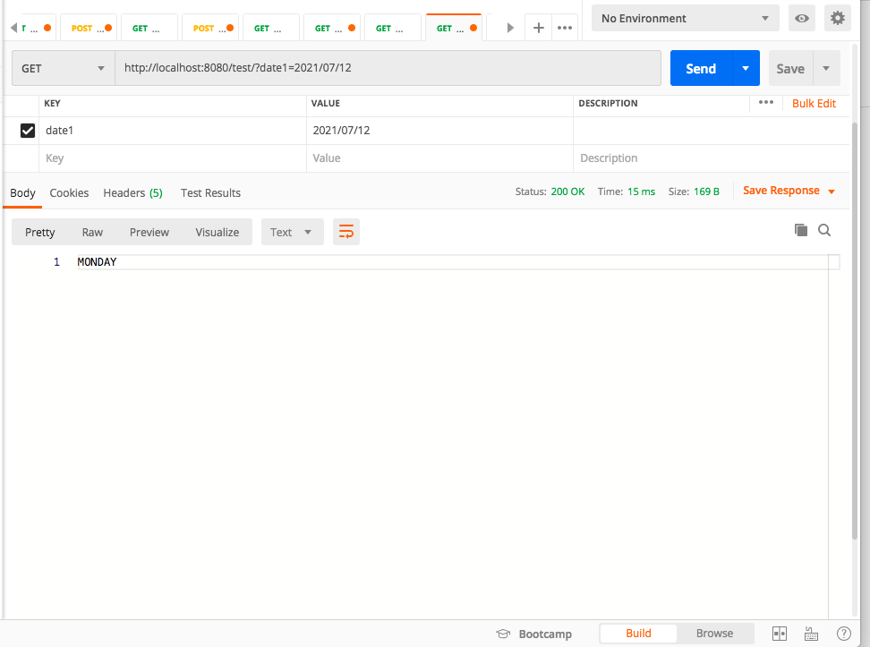

### Project Description

### Library Reference
```sh
Java-8
Maven - Build Tool # Gradle is another option
Spring Dependencies - check pom.xml
```

### Code Component
```sh


Service Layer
  - Build a Date Conversion method to convert String Date as input to get a Day of the week for particlaur date
 
Controller - Api methods
  - Pass the date as paramter in YYYY/mm/dd format
  - Output would be the day of the week like Sunday, Monday etc
     
Configuration
   - spring.mvc.format.date=yyyy-MM-dd
        

```
### Following api can be tested
```sh
   http://localhost:8080/test/?date1=2021/07/12
```
Test Result

 


### Compile the code
```sh
   We need to set the username and password for mysql in local machine to compile the code.
```

### Run the application
```sh
   mvn spring-boot:run
```
### Test the application
```sh
   mvn test
```

