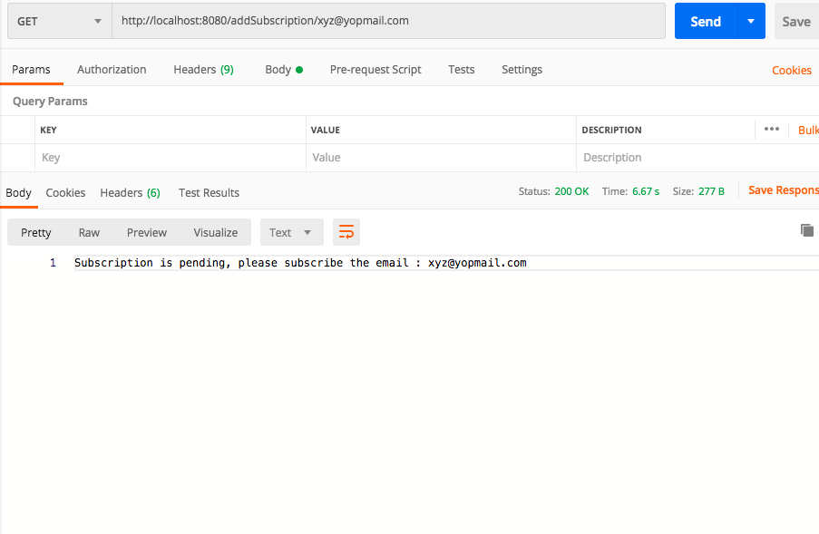
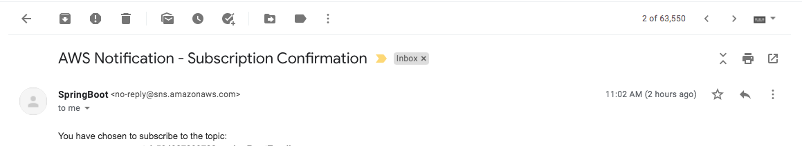
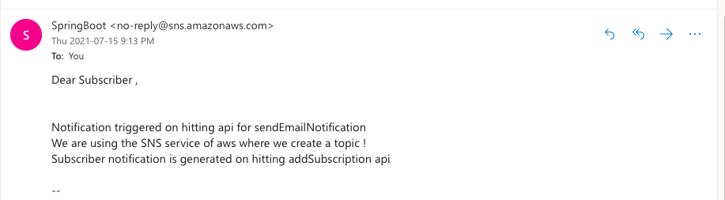

### Project Description
- This code that is committed will show how we can send email notification using RESTAPI calls with SpringBoot/AWS.
- The aws service this used to make it happen is SNS (Simple Notification Service) and the protocol used is email for notification


### Library Reference
```sh
Java-8
Maven - Build Tool # Gradle is another option
Spring Dependencies - check pom.xml
```

### Code Component
```sh
 
     
Configuration
   - Mail Config (validates you aws keys and region for connection)
        
Controller - REST API
  - Two Api calls
  1) Subscription send to email user that you are subscribing for this topic which has to be accepted by the email user
  2) Message send to the email user who subscriobed to the email
```
### Following api can be tested
```sh
   http://localhost:8080/addSubscription/<your-emailaddress> - GET (Subscription api)
   http://localhost:8080/sendEmailNotification - GET (Sends Message to all email user who accepted subscription) 
```

####Api call for Subscribing 


#### Email for Subscription


#### Email Message


### Run the application
```sh
   mvn spring-boot:run
```
### Test the application
```sh
   mvn test
```

